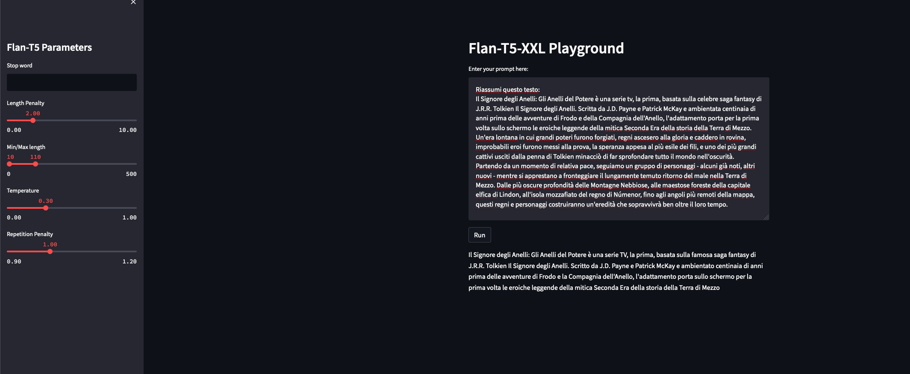

# Multi Language HuggingFace Flan-T5 XXL Sharded using Amazon SageMaker

The scope of this repo is to provide an end-to-end example for using HuggingFace Flan T5 XXL model on AWS by using 
Amazon SageMaker Real-Time Endpoint, Amazon Comprehend, and Amazon Translate for managing multi-language inputs.

## Reference Blogs
1. [Deploy FLAN-T5 XXL on Amazon SageMaker](https://www.philschmid.de/deploy-flan-t5-sagemaker)
2. [Create Your Own Large Language Model Playground in SageMaker Studio](https://towardsdatascience.com/create-your-own-large-language-model-playground-in-sagemaker-studio-1be5846c5089)
3. [Architect personalized generative AI SaaS applications on Amazon SageMaker](https://aws.amazon.com/blogs/machine-learning/architect-personalized-generative-ai-saas-applications-on-amazon-sagemaker/)

## Architecture

## Repository Content

1. [notebook](./notebook): Use Amazon SageMaker Studio Notebooks for testing the end-to-end solution in the notebook [Deploy-LLM-Model](./notebook/Deploy-LLM-Model.ipynb)
2. [project](./project): Automate the creation of an MLOps Pipeline for Model deployment by using SageMaker Project